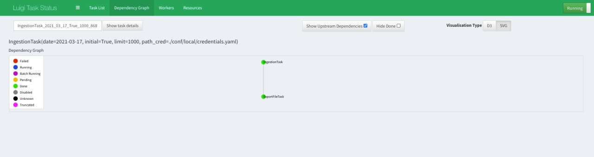

# DPA-Project
Proyecto enfocado al desarrollo de un producto de datos para predecir la acreditación de inspecciones de restaurantes en Chicago

### Integrantes del equipo

| Nombre |
| :------- |
| Karina Lizette Gamboa Puente|
| Miguel López Cruz|
| Oscar Arturo Bringas López|
| Aide Jazmín González Cruz|

### Resumen de  datos con los que se trabajaran

- Número de registros: **215K**
- Número de columnas: **17**
- ¿Qué variables son y qué información tiene?

| Variable | Tipo  | Descripción |
| :------- | :----:| :---------: |
|Inspection ID|Number|Identificador de la inspección|
|DBA Name|Text|Nombre del establecimiento|
|AKA Name|Text|Alias (también conocido como)|
|License #|Number|Número de licencia del establecimiento|
|Facility Type|Text|Tipo de establecimiento|
|Risk|Text|Riesgo de cometer una violación|
|Address|Text|Dirección del establecimiento|
|City|Text|Ciudad donde está el establecimiento|
|State|Text|Estado donde se encuentra el establecimiento|
|Zip|Number|Código postal del establecimiento|
|Inspection Date|Floating Timestamp|Fecha de la inspección|
|Inspection Type|Text|Tipo de inspección|
|Results|Text|Resultado de la inspección|
|Violations|Text|Observaciones de las violaciones encontradas|
|Latitude|Number|Latitud del establecimiento|
|Longitude|Number|Longutud del establecimiento|
|Location|Location|Latitud y Longitud (geopoint)|
    
#### Pregunta analítica a contestar con el modelo predictivo

- ¿El establecimiento pasará o no la inspección?

#### Frecuencia de actualización de los datos

- La frecuencia de datos fuente es diaria, pero en este proyecto se realizará semanalmente de acuerdo a los requerimientos establecidos.


### Requerimientos: 
- Actualizar el repositorio (si ya se tiene) `git pull origin main` o clonarlo en caso de que no.

- Contar con un ambiente virtual con python superior o igual a 3.7.4.(sugerido)

- Instalar los paquetes descritos en el archivo requirements.txt `pip install -r requirements.txt`

- Obtener token de la API de Food inspections. Se puede obtener un token [aquí](https://data.cityofchicago.org/profile/edit/developer_settings)

- Se debe contar con credenciales de AWS (Access key ID y Secret access key) dados por el administrador de la infraestructura en AWS, y guardarlos en un archivo `credentials.yml`. El archivo con las credenciales debe estar en la carpeta `conf/local/credentials.yml`. La estructura del archivo `credentials.yml` debe tener una estructura como la que se presenta a continuación:


```
---
s3:
   aws_access_key_id: "TU_ACCESS_KEY_ID"
   aws_secret_access_key: "SECRET_ACCESS_KEY"
   
food_inspections: 
   api_token: "TU_TOKEN" 
```

### Descripción de librerias iniciales

Las librerías que se descrinen a continuación son de uso general del pipeline y se ecnuentran en la carpeta `src`. Para ejecutar las funciones del estás librerías, es importante ubicarse en la raíz del proyecto y seguir las siguientes instrucciones en la línea de comandos:

- Ejecutar `export PYTHONPATH=$PWD`

- Utilizar un ambiente virtual con python superior o igual a 3.7.4., ejemplo: `pyenv activate nombre_de_tu_ambiente`

- Ejecutar: `python`

#### general.py

- La importación de las funciones del módulo `src/utils/general.py` se hace a través del siguiente comando: 

  `from src.utils.general import read_yaml_file, get_s3_credentials, get_api_token`
    
- Una vez cargado el módulo, se lee un archivo `.yml`, en el cual encuentra las credenciales introducidas en el archivo `yaml`.

```
ry = read_yaml_file("conf/local/credentials.yaml")
```
  
- Con el siguiente comando se obtienen las credenciales S3, las cuales se obtienen también a través del archivo `yaml` creado anteriormente.

```
s3_c = get_s3_credentials("conf/local/credentials.yaml")
```
  
- A continuación, se obtiene el token de acceso a la API, mismo que servirá para poder descargar los datos.

```
token = get_api_token("conf/local/credentials.yaml")
```
#### constants.py 

Este archivo contiene algunas constantes que se usarán en el proyecto, su estructura se muestra a continuación:
  
```
# The Host Name for the API endpoint (the https:// part will be added automatically)
DATA_URL = 'data.cityofchicago.org'
# The data set at the API endpoint
DATA_SET = '4ijn-s7e5'
# Nombre del bucket
BUCKET = "data-product-architecture-equipo-n"
# Path de ingesta histrórica
BUCKET_PATH_HIST = "ingestion/initial/historic-inspections-"
# Path de ingesta consecutiva
BUCKET_PATH_CONS = "ingestion/consecutive/consecutive-inspections-"
```

estos valores se pueden sustiruir pos los propios (nombre de bucket y paths) para probar la ingestión de datos.


#### ingesta_almacenamiento.py

Esta librería permite realizar la extracción de datos y almacenamiento.

- Para cargar las librerías se ejecutan los siguientes comandos: 

  `from src.pipeline.ingesta_almacenamiento import get_client, ingesta_inicial, get_s3_resource, guardar_ingesta, ingesta_consecutiva`
  
  `import src.utils.constants as cte`
  
esta libería usa internamente un archivo de constantes, el cual esta en la ruta `src/utils/constants.py`, que ya se describio anteriormente.

  
- Para obtener el cliente se usa la función `get_client`, agregando el token que anteriormente fue generado. La implementación se muestra a continuación:

```
cliente = get_client(token)
```

- Para realizar la obtención de datos de la ingesta inicial, se implementa la función `ingesta_inicial` que recibe como parámetros un cliente y el límite de datos, como se indica a continuación:

```
datos_his = ingesta_inicial(cliente, 300000)
```

- Para obtener el recurso de S3, se usa la función `get_s3_resource` y se implementa como sigue:

```
s3_resource = get_s3_resource()
```

- Se declaran las siguientes variables, con el nombre del bucket y los paths donde se guardará la ingesta inicial y consecutiva.

```
bucket = cte.BUCKET
bucket_path_hist = cte.BUCKET_PATH_HIST
bucket_path_cons = cte.BUCKET_PATH_CONS
```

- Para guardar la ingesta se usa la función `guardar_ingesta`, que recibe como parámetros el nombre del bucket, el path y los datos, se implementa como sigue:

```
guardar_ingesta(bucket, bucket_path_hist, datos_his)
```

- Para obtener los datos consecutivos se usa la función `ingesta_consecutiva`, que recibe como parámetros el cliente, una fecha a partir de donde se extraerán los datos y el límite de los mismos, se podrá llamar de la siguiente manera:

```
datos_cons = ingesta_consecutiva(cliente, '2021-02-14', 2000)
```

Si se le pasa `None` al segundo parámetro (fecha), restará al día actual 7 días para obtener los datos de una semana atrás.

- Finalmente se puede usar nuevamente la función `guardar_ingesta` para cargar en el bucket los datos consecutivos.

```
guardar_ingesta(bucket, bucket_path_cons, datos_cons)
```

Una vez que este comando ha finalizado, puede dirigirse al bucket S3 de AWS en donde se realizó la ingesta de los datos para verificar que efectivamente han sido almacenados satisfactoriamente.

### Primeros pasos con Luigi: 

En esta parte se muestra como correr una ingesta histórica y consecutiva de datos usando el orquestador `luigi`. Para ello requiere seguir los siguientes pasos. 

- Actualizar el repositorio (si ya se tiene) `git pull origin main` o clonarlo en caso de que no.

- Inicie su ambiente virtual `pyenv activate nombre_de_tu_ambiente`

- Instalar los paquetes descritos en el archivo requirements.txt `pip install -r requirements.txt` o en caso de que ya tenga la parte anterior ejecutar sólo `pip install luigi`

- Para activar el `Central Scheduler` de `luigi` abra una terminal e ingrese `luigid`

#### Ingesta

- Para correr una **ingesta inicial** (histórica) se usa la tarea `IngestionTask` que se encuentra en la librería `LuigiIngestionTasks.py` en la ruta `src.pipeline`, abra otra ventana dentro de su mismo ambiente, y coloquese en la raíz del proyecto e ingrese las siguientes líneas de código:

```
PYTHONPATH='.' luigi \
--module src.pipeline.LuigiIngestionTasks IngestionTask \
--local-scheduler \
--path-cred ./conf/local/credentials.yaml \
--initial true \
--limit 300000 \
--date '2021-02-21'
```

Descripción:

***-- module*** se especifica el modulo a cargar, en este caso se llama a `src.pipeline.LuigiIngestionTasks` seguido del nombre de la tarea `IngestionTask` encargada de hacer la ingestión de datos, extrae a travéz de la API de Food inspections los datos que serán guardados en un `pickle`.

***--local-scheduler*** con esta opción no se muestra el resultado en el `Central Scheduler`, para reflejar el resultado en el este se debe omitir esta opción.

***--path-cred*** se indica la ruta del archivo que contiene las credenciales, en este caso se encuentra en `./conf/local/credentials.yaml`, recuerde que debe contar con su archivo `credentials.yml` en la carpeta `conf/local/`

***--initial*** con esta bandera en `true` indica que se hará una ingesta inicial (histórica). En caso de una ingesta consecutiva deberá ir en `false`

***--limit*** esta bandera indica el limite de datos, para la ingesta histórica se sugiere vaya en *300000*, el cual es el dato por default, para este ejemplo se a colocado el valor de 100.

***--date*** con esta la bandera se indica desde que fecha se requiere la ingesta inicial.

- Para una **ingesta consecutiva** se corre la siguiente secuencia de comandos, de acuerdo a las opciones descritas anteriormente.

```
PYTHONPATH='.' luigi \
--module src.pipeline.LuigiIngestionTasks IngestionTask \
--local-scheduler \
--path-cred ./conf/local/credentials.yaml \
--initial false \
--limit 2000 \
--date '2021-03-01'
```

- Estas ingestas generaran un archivo tipo `pickle`, por lo que se creara una carpeta llamada `ingestion` en la raíz del proyecto, la cuál contendra 2 carpetas: `initial` y `consecutive`, y dentro de ellas encontrará el archivo histórico (historic-inspections-2021-01-01.pkl para el ejemplo mostrado) y la ingesta consecutiva (consecutive-inspections-2021-03-15.pkl para el ejemplo mostrado) respectivamente.

#### Almacenamiento

Para guardar estos archivos en S3 se usa la tarea `ExportFileTask` que se encuentra en la librería `LuigiExportTasks.py` en la ruta `src.pipeline`, siguiendo las siguientes líneas de código.

- Para guardar en S3 la **ingesta inicial** (histórica) se tiene:

```
PYTHONPATH='.' luigi \
--module src.pipeline.LuigiExportTasks ExportFileTask \
--path-cred ./conf/local/credentials.yaml \
--initial true \
--limit 300000 \
--date '2021-02-21'
```

Donde adicionalmente puede ingresar el nombre del bucket en S3, con la bandera `--bucket-path` seguido del nombre de su `bucket` (ejemplo `--bucket-path 'data-product-architecture-equipo-n`), el cuál por default toma el valor de la constante `BUCKET`. En este caso se carga la ingesta inicial dado por `--initial true` y las opciones `--limit`, `--date`, `path-cred` serán pasadas a la tarea 1 (`IngestionTask`) en caso de que no se haya ejecutado. 


- Para guardar en S3 una **ingesta consecutiva** es similar, sólo pasando en la opción `--initial` el valor de `false`:

```
PYTHONPATH='.' luigi \
--module src.pipeline.LuigiExportTasks ExportFileTask \
--path-cred ./conf/local/credentials.yaml \
--initial false \
--limit 2000 \
--date '2021-03-01'
```

- Una vez ejecutados correctamente las tareas, podrá verificar que sus archivos se encuentran en `AWS` en el bucket especificado y en la ruta `ingestion/initial/` para cargas iniciales y en la ruta `ingestion/consecutive/` para cargas consecutivas.

- Así mismo verificar el estatus de las tareas en `http:\\localhost:8082` en el `Central Scheduler` de `luigi`, siempre y cuando haya omitido la opción `--local-schedule` a la hora de ejecutar los comandos. 

- Si todo fue correcto, observará la siguiente salida:

 


