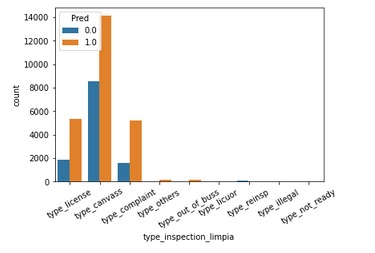
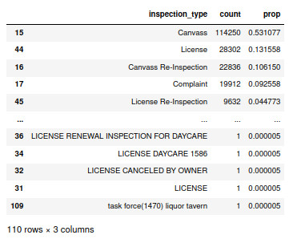

<table>
	<tr>
		<td style="text-aling: center; font-weight: bold; font-size: 24px">🟢 Maestría en Ciencia de Datos</td>
		<td rowspan="3"><p align = "right"></p></td>
	</tr>
	<tr>
		<td style="text-aling: center; font-weight: bold; font-size: 20px">:red_circle: Métodos de Gran Escala</td>
	</tr>
		<td>
			<table>
				<tr><td style="font-weight: bold;">:black_circle: Colaboradores</td></tr>
				<tr><td>Karina Lizette Gamboa Puente</td></tr>
				<tr><td>Oscar Arturo Bringas López</td></tr>
				<tr><td>Aide Jazmín González Cruz</td></tr>
				<tr><td>Miguel López Cruz</td></tr>
				<tr>
			</table>
		</td>
	</tr>
</table>

# DPA-Project: Food Inspections :pizza: :hamburger: :coffee: :rice_cracker: :poultry_leg: :bento: :ramen:

## :large_blue_circle: Tabla de contenido

1. [Introducción](https://github.com/Acturio/DPA-Project/blob/main/README.md#introducci%C3%B3n-clipboard) :clipboard:
2. [Información general](https://github.com/Acturio/DPA-Project/blob/main/README.md#informaci%C3%B3n-general-bookmark_tabs) :bookmark_tabs:
3. [Requerimientos de infraestructura](https://github.com/Acturio/DPA-Project/blob/main/README.md#requerimientos-de-infraestructura-computer) :computer:
4. [Instalación](https://github.com/Acturio/DPA-Project/blob/main/README.md#instalaci%C3%B3n-minidisc) :minidisc:
5. [Organización del código](https://github.com/Acturio/DPA-Project/blob/main/README.md#organizaci%C3%B3n-del-c%C3%B3digo-octocat) :octocat:
6. [Correr el pipeline](https://github.com/Acturio/DPA-Project/blob/main/README.md#correr_el_pipeline-green_circle) :green_circle:
7. [Sesgo e inequidad](https://github.com/Acturio/DPA-Project/blob/main/README.md#sesgo_e_inequidad-bar_chart) :bar_chart:

## Introducción :clipboard:

Este proyecto esta enfocado a realizar una predicción de los establecimientos de comida en la Ciudad de Chicago que tengan más probabilidad de cometer una violación y por lo tanto se les hará una inspección, de esta manera se priorizarán las visitas a estos establecimientos.

## Información general :bookmark_tabs:

A continuación se presenta un resúmen de los datos con los cuales se trabajará:

- Número de registros: **215K**
- Número de columnas: **17**
- Diccionario de datos:

| Variable | Tipo  | Descripción |
| :------- | :----:| :---------: |
|Inspection ID|Number|Identificador de la inspección|
|DBA Name|Text|Nombre del establecimiento|
|AKA Name|Text|Alias (también conocido como)|
|License #|Number|Número de licencia del establecimiento|
|Facility Type|Text|Tipo de establecimiento|
|Risk|Text|Riesgo de cometer una violación|
|Address|Text|Dirección del establecimiento|
|City|Text|Ciudad donde está el establecimiento|
|State|Text|Estado donde se encuentra el establecimiento|
|Zip|Number|Código postal del establecimiento|
|Inspection Date|Floating Timestamp|Fecha de la inspección|
|Inspection Type|Text|Tipo de inspección|
|Results|Text|Resultado de la inspección|
|Violations|Text|Observaciones de las violaciones encontradas|
|Latitude|Number|Latitud del establecimiento|
|Longitude|Number|Longutud del establecimiento|
|Location|Location|Latitud y Longitud (geopoint)|
    
#### Pregunta analítica a contestar con el modelo predictivo

Con este proyecto pensamos contestar la siguiente pregunta:

- ¿El establecimiento pasará o no la inspección?

#### Frecuencia de actualización de los datos

- La frecuencia de datos fuente es diaria, sin embargo en en este proyecto se realizará semanalmente.

## Requerimientos de infraestructura. :computer:

El presente proyecto se elabora siguiendo una estructura en la nube, usando los servicios de AWS cuyo diagrama se muestra a continuación:

 


Se accede de manera local desde una PC/Laptop, y el filtro de entrada es nuestra máquina de bastion que funciona como cadenero de la infrestructura en la nube, y este por medio de SSH permite la conexión a la maquina EC2 que es la que contiene el código del proyecto y  tiene comunicación con la RDS.


## Instalación :minidisc:

### Requerimientos

1. **Clonar el repositorio**

- Para comenzar deberá [instalar la librería de git](https://github.com/git-guides/install-git), para ello puede seguirlos pasos descritos en esta página.

- Clonar el repositorio en la máquina EC2.

```
git clone https://github.com/Acturio/DPA-Project
```

2. **Ambiente virtual**

- Deberá instalar [pyenv](https://github.com/pyenv/pyenv), para configurar un ambiente virtual [pyenv-virtualenv](https://github.com/pyenv/pyenv-virtualenv) con python superior o igual a 3.7.4., al cual podra acceder con el siguiente comando como ejemplo: 

```
pyenv activate nombre_de_tu_ambiente
```

3. **Librerías**

- Una vez dentro del abiente instalar los paquetes descritos en el archivo requirements.txt con el siguiente comando:

```
pip install -r requirements.txt
```

4. **Credenciales**


Se necesitan obtener los siguientes recursos de conexión:

- Obtener token de la `API de Food inspections`, para ello de clic [aquí](https://data.cityofchicago.org/profile/edit/developer_settings)

- Se debe contar con credenciales de AWS (Access key ID y Secret access key) dados por el administrador de la infraestructura en AWS, y guardarlos en un archivo `credentials.yaml`. El archivo con las credenciales debe estar en la carpeta `conf/local/credentials.yaml` y deberá estar en la lista de `git ignore` para que sus datos esten seguros. La estructura del archivo `credentials.yaml` debe tener una estructura como la que se presenta a continuación:


```
---
s3:
   aws_access_key_id: "TU_ACCESS_KEY_ID"
   aws_secret_access_key: "SECRET_ACCESS_KEY"
   
food_inspections: 
   api_token: "TU_TOKEN" 
   
db:
  user: "usuario_db"
  pass: "password_db"
  host: "host_rds"
  port: "puerto"
  database: "nombre_db"

```

- Para la conexión a la base de datos como servicio se necesita un archivo `.pg_service.conf` alojado en la máquina EC2 con la siguiente estructura

```
# Conexión RDS
[db_service]
host=host_rds
port=puerto
user=usuario_db
dbname=nombre_db
password=password_db 
```


Y se deberá ejecutar lo siguiente para guadarlo en las variables globales (en este ejemplo guardamos el archivo `.pg_service.conf` en `home`)

```
export PGSERVICEFILE=${HOME}/.pg_service.conf   
export PGSERVICE=db_service
```

De esta manera se puede conectar a la base de postgresql corriendo el siguiente comando:

```
psql service=db_service
```

Para crear el squema de metadata se corre el siguiente query 

```
psql service=db_service -f ruta_repositoro/sql/create_metadata.sql
```

## Organización del código :octocat:

El repositorio se encuentra organizado de la siguiente manera:

```
├── README.md          <- The top-level README for developers using this project.
├── conf
│   ├── base           <- Space for shared configurations like parameters
│   └── local          <- Space for local configurations, usually credentials
│
├── docs               <- Space for Sphinx documentation
│
├── notebooks          <- Jupyter notebooks.
│
├── references         <- Data dictionaries, manuals, and all other explanatory materials.
│
├── results            <- Intermediate analysis as HTML, PDF, LaTeX, etc.
│
├── requirements.txt   <- The requirements file
│
├── .gitignore         <- Avoids uploading data, credentials, outputs, system files etc
│
├── infrastructure
├── sql
├── setup.py
└── src                <- Source code for use in this project.
    ├── __init__.py    <- Makes src a Python module
    │
    ├── utils      <- Functions used across the project
    │
    │
    ├── etl       <- Scripts to transform data from raw to intermediate
    │
    │
    ├── pipeline

```


## Correr el pipeline :green_circle:

- Se deberá configurar un ***Foxy-Proxy*** para que tu browser pueda mostrar contenido de los web services que ocuparemos en el EMR. Para ello deberás seguir las [instrucciones](https://docs.aws.amazon.com/emr/latest/ManagementGuide/emr-connect-master-node-proxy.html) en este tutoria, ya que dependiendo del navegador que se tenga los pasos de configuración son diferentes, además es recomendable hacerlo sobre `Chrome` ya que es el navegador con más compatibilidad con la funciónque se busca.


- Desde la EC2 podrá ejecutar el siguiente pipele, es importante ubicarse en la raíz del proyecto


- Deberá ingresar a la máquina de bastion desde su máquina en el comando.

```
ssh -i llave_publica_aws usuario@host_bastion
```

- Una vez en bastion deberá conectarse a la EC2

```
ssh -i llave_publica_aws usuario@host_ec2
```

Como sugerencia le recomendmos abrir 3 terminales con los 2 procedimientos decritos previamente.

- En la primera ventana ejecutamos `luigid` dentro de nuestro ambiente virtual, esto nos permitirá acceder al servicio de `Foxy-Proxy` que se configuró en el inicio de este apartado, y sirve para habilitar el scheduler en nuestro navegador local ingresado la dirección `http:\\localhost:8082`.

- La segunda ventana nos servirá para ejecutar el pipeline, el cuál debe correr con la siguiente estructura:


```
PYTHONPATH='.' luigi \
--module src.pipeline.LuigiModelSelectionMetadataTask ModelSelectionMetadataTask \
--path-cred ./conf/local/credentials.yaml \
--initial false \
--limit 2000 \
--date '2021-04-16' \
--exercise true \
--local-scheduler
```

Descripción:

***-- module*** se especifica el modulo a cargar, seguido del nombre de la tarea.

***--local-scheduler*** con esta opción no se muestra el resultado en el `Central Scheduler`, para reflejar el resultado en el este se debe omitir esta opción.

***--path-cred*** se indica la ruta del archivo que contiene las credenciales, en este caso se encuentra en `./conf/local/credentials.yaml`, recuerde que debe contar con su archivo `credentials.yaml` en la carpeta `conf/local/`

***--initial*** con esta bandera en `true` indica que se hará una ingesta inicial (histórica). En caso de una ingesta consecutiva deberá ir en `false`

***--limit*** esta bandera indica el limite de datos, para la ingesta histórica se sugiere vaya en *300000*, el cual es el dato por default, para este ejemplo se a colocado el valor de 100.

***--date*** con esta la bandera se indica desde que fecha se requiere la ingesta inicial. **Nota:** En caso de que se le pase como parámetro una fecha mayor al día de hoy, el pipeline fallará e indicará que no se permiten este tipo de fechas.

***--exercise*** con esta bandera se le indica si toma una muestra con `true` y si es `false` toma todos los datos.

- Para una **ingesta consecutiva** se corre la siguiente secuencia de comandos, de acuerdo a las opciones descritas anteriormente.


- Finalmente la tercera ventana nos servirá para mantener la conexión a la base de datos para supervisar la carga de datos. Para ello usaremos la línea de comando descrita en la parte de conexiones.

```
psql service=db_service
```
 y se podrán ejecutar los `selects` a las tablas de metadata para observar los datos insertados
 
```
SELECT * FROM metadata.ingestion;
SELECT * FROM metadata.almacenamiento;
SELECT * FROM metadata.cleaning;
SELECT * FROM metadata.feature;
SELECT * FROM metadata.entrenamiento;
SELECT * FROM metadata.seleccion;
SELECT * FROM metadata.bias_fairness;
```

y para los `test`

```
SELECT * FROM metadata.test_ingestion;
SELECT * FROM metadata.test_almacenamiento;
SELECT * FROM metadata.test_cleaning;
SELECT * FROM metadata.test_feature;
SELECT * FROM metadata.test_entrenamiento;
SELECT * FROM metadata.test_seleccion;
SELECT * FROM metadata.test_bias_fairness;
```

la tabla de seguimiento de los `tasks` que corre luigi los podrá consultar con:

```
SELECT * FROM public.table_updates;
```

- Una vez ejecutados correctamente las tareas, podrá verificar que sus archivos se encuentran en `AWS` en el bucket especificado y en la ruta `ingestion/initial/` para cargas iniciales y en la ruta `ingestion/consecutive/` para cargas consecutivas.

- Así mismo verificar el estatus de las tareas en `http:\\localhost:8082` en el `Central Scheduler` de `luigi`, siempre y cuando haya omitido la opción `--local-schedule` a la hora de ejecutar los comandos. 

- Si todo fue correcto, observará la siguiente salida:

 


 


## Sesgo e inequidad :bar_chart:

En este proyecto estamos considerando como variable protegida el tipo de inspección, de la base original (histórica) se pueden cuantificar 96 disintos tipos de inspección, sin embargo se creo una nueva variable (`type_inspection_limpia`) que agrupa estas sólo 10 tipos:

- Canvass
- License
- Licuor
- Complaint
- Reinspection
- Ilegal
- Out of bussiness
- Not ready
- Pre license
- Others

Por lo que nuestro atributo protegido es esta variable `type_inspection_limpia`.

El grupo de refrencia es `Canvass`, ya que es la categoría con mayor tamaño entre todos los grupos existentes, con un 53 % aproximadamente.

<table>
	<tr>
		<td></td>
		<td></td>
	</tr>
</table> 

Analizando el proyecto y viendolo desde el punto de vista del usuario (dueño del establecimiento) llegamos a la conclusión de que es un modelo *asistivo*, ya que le va a decir si irán o no a inspeccioanr su establecimiento, por tanto podrá estar preparado.

En este caso al ser un modelo asistivo tenemos que las variables a cuantificar son: `Recall parity`, `FN/GS Parity`, `FOR Parity` y `FNR Parity`, de acuerdo al `Farirness tree`, sin embargo como el modelo afectará a una pequeña fracción de la población, sólo nos enfocaremos a medir el ***Recall parity***.


Los resultadados de sesgo e inequidad se guardan en la tabla sesgo.bias_fairness del RDS, se pueden consultar con el `query`:

```
SELECT * FROM sesgo.bias_fairness;
```


